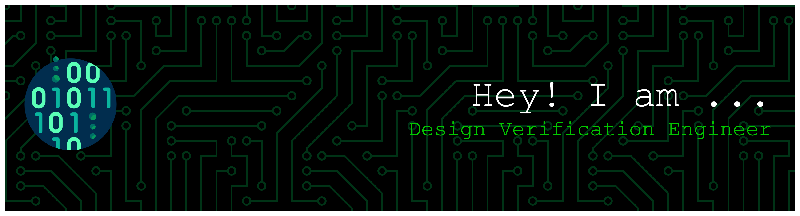

<h1 align="center">Hi 👋, I'm Devanshu Gajjar</h1>
<h3 align="center">Design Verification Engineer | SoC Verification | UVM | Functional Coverage | Assertion-Based Verification</h3>

---

### 👨‍💻 About Me

I’m a **Design Verification Engineer** with a strong focus on **SoC and ASIC verification**, currently pursuing my **M.S. in Electrical Engineering** at **San Jose State University (GPA 3.8/4.0)**.  

My experience spans **UVM-based environments**, **functional coverage**, and **assertion-based verification**, with hands-on exposure to **AXI**, **APB**, and **I2C** protocols.  

I’m passionate about ensuring **functional correctness**, **performance validation**, and **design robustness** through well-structured **test planning** and **coverage-driven methodologies**.

---

### 🧠 Skills & Tools

**Languages:**  
`SystemVerilog` • `Verilog` • `UVM` • `C` • `C++` • `Python` • `Tcl` • `YAML`  

**Tools:**  
`Synopsys VCS` • `Cadence Xcelium` • `Xilinx Vivado` • `Vivado HLS` • `Vitis` • `ModelSim` • `PrimeTime` • `GTKWave` • `STM32CubeIDE`  

**Bus Protocols:**  
`AMBA AXI4 / AXI4-Lite` • `APB` • `SPI` • `I2C` • `UART`  

**Core Areas:**  
SoC Verification • RTL Design • Digital Logic • Post-Silicon Validation • Static Timing Analysis • OOPS  

---

### 💼 Professional Experience

**👨‍🏫 Teaching Assistant – Digital Logic Circuit Design (EE 118), SJSU**  
*Aug 2025 – Present*  
- Teaching digital logic design and its VHDL implementation covering combinational circuits and FSMs.  
- Guiding 27+ students on RTL design, FPGA-based projects, and CPU architecture labs.

**🔬 Einfochips Pvt Ltd – ASIC Design Verification Engineer**  
*Jul 2023 – Dec 2023*  
- Verified an I2C master core via APB interface using **SystemVerilog UVM-based testbench**.  
- Built feature-driven verification plans achieving **90% functional coverage**.  
- Reduced simulation debug time by **20%** via waveform-triggered assertions.

**🧩 Microsoft (via Einfochips) – Post-Silicon Validation Engineer**  
*Oct 2021 – Jun 2023*  
- Developed L3-level verification plans, achieving **>95% toggle coverage**.  
- Designed SoC-level validation test plans and performed stress testing for reliability.  
- Led a team implementing **SWJTAG on RP2040** with FTDI FT2322H & PyFTDI, reducing cost by **50%**.

---

### 🚀 Featured Projects

#### 🧩 **Design & Verification of AMBA AXI Protocol** – *SystemVerilog, UVM*
- Built AXI4 master supporting burst transactions and data alignment.
- Created UVM-based verification environment with assertions & coverage for corner-case validation.

#### ⚙️ **Floating Point Engine with Dual Bus Architecture**
- Implemented IEEE 754-compliant FPU using shared datapath.
- Developed custom dual-bus interface for high-speed control & memory operations.

#### 💡 **5-Stage Pipelined MIPS Processor** – *Verilog, QuestaSim*
- Designed MIPS processor with forwarding and branch prediction logic.
- Simulated benchmark programs and validated performance using QuestaSim.

#### 🔄 **UART Controller with FIFO Buffers (AXI-Lite)** – *Verilog, Vivado, Vitis*
- Built AXI-Lite-based UART controller reducing CPU wait time by **88%**.
- Integrated with MicroBlaze processor & developed C drivers in Vitis.

#### 💾 **Cache Simulator** – *Python, Jupyter Notebook*
- Simulated cache memory with configurable size, associativity, and replacement policies (LRU, FIFO).  
- Computed hit/miss rates for 32-bit processor traces.

---

### 🌱 Currently Learning
- Advanced **UVM Methodologies**  
- **SoC Design Verification Frameworks**  

### 👯 Collaboration Interests
- ASIC / FPGA Verification Projects  
- Open-source **SystemVerilog** or **UVM** tools  

---

### 🌐 Connect With Me

---

### 🏆 GitHub Highlights

